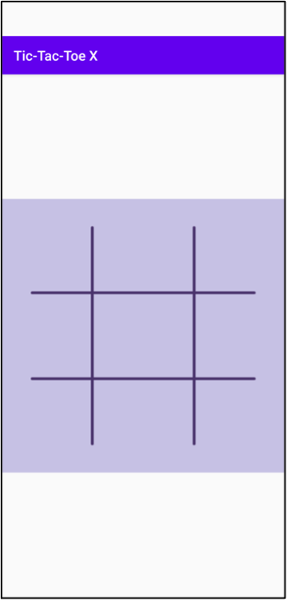
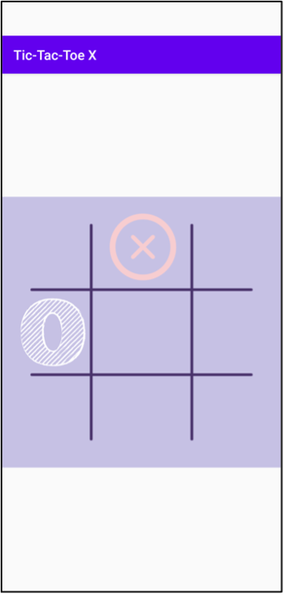
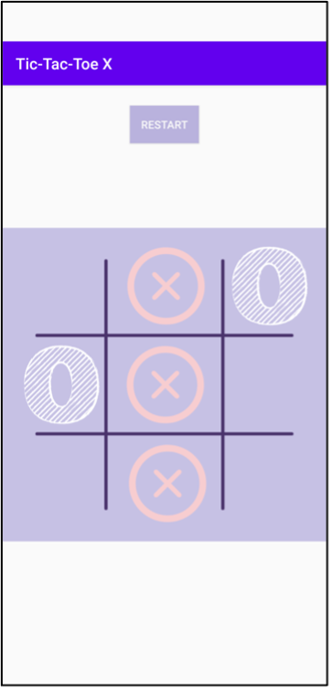

#  &nbsp; Tic-Tac-Toe -

This project was build as a part of Android App Development course provided by the startup company Golden Bird Learning Pvt. Ltd. It was used to teach engineering undergraduate students how to build a simple one screen android game that involves animations and mathematical logic. The IDE and languages used were Android Studio and Java. The software used for designing was Adobe XD. It is a two player game, where the opponents can play the classic game of Tic-Tac-Toe on one device.

## Game Images -

 
 &nbsp; &nbsp;
 

 
